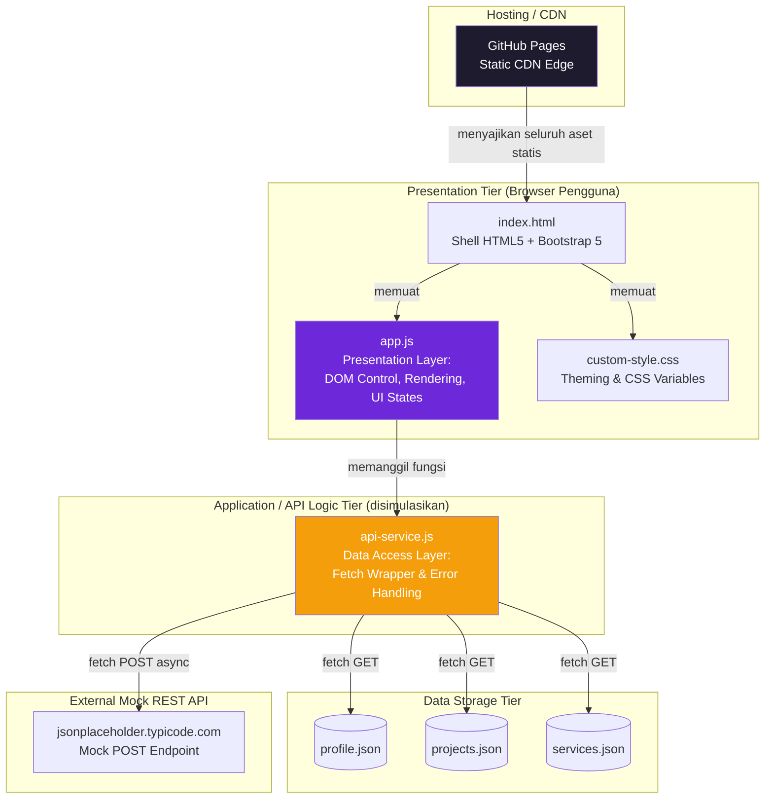

# Praktikum Minggu 4 — Decoupled Multi-Tier Architecture & Dynamic CSR

**Nama:** Grasia Gayatri Simanullang
**NIM:** 12S24027
**Kelas:** S1 Sistem Informasi — Institut Teknologi Del
**Mata Kuliah:** Pemrograman dan Pengujian Web (12S3101)

---

## Deskripsi

Proyek ini merupakan transformasi arsitektural dari portofolio Bootstrap 5 (Minggu 3) yang sebelumnya
bersifat **monolitik statis** (seluruh data kartu proyek dan layanan ditulis langsung/hardcoded di
`index.html`), menjadi arsitektur **decoupled multi-tier** dengan **Dynamic Client-Side Rendering (CSR)**.
Seluruh konten kini diinjeksi secara asinkron dari penyedia data JSON modular melalui JavaScript ES6+.

---

## 1. Diagram Arsitektur Sistem (C4 Container Model)



### Narasi Separation of Concerns

- **Presentation Tier** (`index.html`, `app.js`, `custom-style.css`) hanya bertugas menampilkan antarmuka
  dan merespons interaksi pengguna. Tier ini **tidak tahu** dari mana data berasal — ia hanya memanggil
  fungsi `ApiService.getProjects()`, `getServices()`, dll.
- **Application/API Logic Tier** disimulasikan oleh `api-service.js`. Seluruh logika `fetch()`, penanganan
  error HTTP, dan serialisasi JSON terpusat di sini. Jika suatu saat data JSON statis ini diganti backend
  sungguhan (Node.js/Express, misalnya), **hanya file ini yang perlu diubah** — `app.js` tidak perlu disentuh.
- **Data Storage Tier** direpresentasikan oleh 3 berkas JSON independen (`profile.json`, `projects.json`,
  `services.json`), meniru pola *decoupled REST resource* di mana setiap entitas punya endpoint/sumbernya
  sendiri.
- Formulir kontak mengirim data ke **Mock REST API eksternal** (jsonplaceholder) karena GitHub Pages adalah
  *static hosting* tanpa server aktif — namun pola request/response asinkronnya identik dengan integrasi
  backend nyata.

---

## 2. Fitur & Perubahan Arsitektural Minggu 4

- **Dynamic CSR:** Seluruh kartu proyek dan katalog layanan **tidak lagi hardcoded** — dimuat via
  `fetch()` + `async/await` dari file JSON.
- **4 UI States Terkelola:** Loading (skeleton pulse), Success (kartu ter-render), Empty (filter kosong),
  Error (alert defensif + tombol "Coba Lagi").
- **Universal Dynamic Modal:** Hanya **1 elemen modal** (`#universalProjectModal`) di HTML untuk
  menampilkan detail seluruh proyek, konten diinjeksi berdasarkan `project-id`.
- **Filter Kategori Instan:** Tombol filter dibuat otomatis dari kategori unik yang ada di `projects.json`.
- **Form REST Asinkron:** Submit form tidak memicu reload halaman; status tombol berubah jadi spinner,
  lalu notifikasi **Bootstrap Toast** muncul sebagai feedback.
- **Local State Persistence:** Setiap order tersimpan di `localStorage`, ditampilkan sebagai badge angka
  di navbar (`#orderBadge`).
- **Sanitasi XSS:** Fungsi `escapeHTML()` di `app.js` membungkus setiap nilai dinamis dari JSON sebelum
  disisipkan ke `innerHTML`, mencegah DOM-based XSS.

---

## 3. Tabel Komparasi: Sebelum (Week 3) vs Sesudah (Week 4)

| Aspek                     | Week 3 (Monolitik Statis)                            | Week 4 (Decoupled Dynamic CSR)                              |
| :------------------------ | :------------------------------------------------------ | :-------------------------------------------------------------- |
| **Sumber Data**          | Hardcoded langsung di `index.html`                       | Terpisah di `data/*.json`, dimuat via `fetch()`                  |
| **Rendering**            | Statis saat halaman dibuka                                | Dinamis (async/await) setelah data tiba                         |
| **Penanganan Error**     | Tidak ada — jika data salah, tampilan tetap "kelihatan benar" | Error State eksplisit dengan alert & tombol retry              |
| **Skalabilitas Konten**  | Tambah proyek = edit HTML manual                          | Tambah proyek = tambah 1 objek di `projects.json`                |
| **Modal Detail**         | 4 elemen modal duplikat di HTML                            | 1 modal universal, konten diinjeksi dinamis                     |
| **Pengiriman Form**      | Reload penuh saat submit                                   | Asinkron via Fetch POST, tanpa reload                           |
| **Persistensi Data**     | Tidak ada                                                  | `localStorage` menyimpan riwayat pesanan                        |
| **Keamanan**              | Tidak relevan (semua statis)                                | Sanitasi `escapeHTML()` mencegah DOM-based XSS                  |

---

## 4. Analisis Performa & Caching (DevTools Network Tab)

> **Cara mengukur:** Buka halaman live di Chrome/Edge → tekan `F12` → tab **Network** → refresh halaman
> dengan `Ctrl+Shift+R` (Cold Load, cache dikosongkan) lalu `Ctrl+R` (Warm Load, cache terpakai). Klik
> salah satu file JSON di daftar request untuk melihat header `Cache-Control`, `ETag`, dan status code-nya.

| Metrik                          | Cold Load (cache kosong) | Warm Load (cache terpakai) |
| :------------------------------- | :------------------------: | :---------------------------: |
| Time to First Byte (TTFB)       | *(isi setelah pengujian)*  | *(isi setelah pengujian)*     |
| First Contentful Paint (FCP)    | *(isi setelah pengujian)*  | *(isi setelah pengujian)*     |
| Status `projects.json`          | `200 OK`                   | `200 OK` / `304 Not Modified` |
| Ukuran transfer `projects.json` | *(isi, mis. 1.2 KB)*       | *(isi, mis. 0 B jika 304)*    |
| Total waktu load halaman        | *(isi setelah pengujian)*  | *(isi setelah pengujian)*     |

**Tempel screenshot tab Network (Waterfall) di sini setelah pengujian dilakukan.**

### Catatan Analisis
*(Tulis 2–3 kalimat kesimpulanmu di sini — misalnya: apakah warm load jauh lebih cepat dari cold load?
Apakah `304 Not Modified` muncul pada reload kedua? Apa arti hasil ini bagi pengalaman pengguna nyata?)*

---

## 5. Struktur Berkas

```
ppw-2026-week4-12S24027/
├── index.html
├── css/
│   └── custom-style.css
├── data/
│   ├── profile.json
│   ├── projects.json
│   └── services.json
├── js/
│   ├── api-service.js
│   └── app.js
└── README.md
```

---

## 6. Cara Menjalankan

1. Clone repositori ini.
2. **Wajib** gunakan **Live Server** (VS Code extension) atau server lokal lain — membuka `index.html`
   langsung via `file://` akan **memblokir** `fetch()` ke file JSON karena kebijakan CORS browser terhadap
   protokol lokal.
3. Pastikan koneksi internet aktif untuk memuat Bootstrap CDN dan Mock REST API.

---

## 7. Live Demo

- **Repositori GitHub:** `https://github.com/Grasiasimanullang/ppw-2026-week4-12S24027`
- **GitHub Pages:** `https://grasiasimanullang.github.io/ppw-2026-week4-12S24027/`

*(Perbarui tautan di atas sesuai nama repositori final kamu setelah push.)*

---

## 8. Checklist Pemenuhan Tugas

- [x] Diagram Arsitektur C4 Container (Mermaid) dengan narasi Separation of Concerns
- [x] Data terpisah ke `/data`: `profile.json`, `projects.json` (4 proyek), `services.json` (3 paket)
- [x] `index.html` bersih dari kartu hardcoded; rendering dinamis via `async/await`
- [x] 4 UI States: Loading, Success, Empty, Error
- [x] Filter kategori instan
- [x] 1 Universal Dynamic Modal, aman dari XSS (`escapeHTML`)
- [x] Form dikirim asinkron (Fetch POST), feedback Bootstrap Toast, tersimpan di `localStorage`
- [ ] Tabel pengukuran DevTools diisi dengan data pengujian nyata + screenshot
- [ ] Branch `week4-architecture` dibuat & di-push ke GitHub
- [ ] GitHub Pages diaktifkan & tidak error 404

---

*Modul Praktikum disusun oleh Chandro Pardede, S.Kom., M.Sc. — Mata Kuliah Pemrograman dan Pengujian
Aplikasi Web (12S3101), Institut Teknologi Del.*